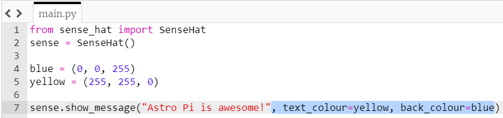

## Displaying text

+ Display the text "Astro Pi is awesome" on your Sense HAT's LED display.

[[[rpi-sensehat-show-message]]]

We can change how the message is displayed by adding some extra **parameters** to the `show_message` command.

**scroll_speed**: affects how quickly the text moves across the screen. The default value is `0.1`. The bigger the number, the lower the speed.

**text_colour**: alters the colour of the text and is defined via three values to specify red, green, and blue. These are also called RGB values.

Check out the sections below to learn more about RGB values.

[[[rpi-sensehat-display-colour]]]
[[[generic-theory-colours]]]

**back_colour**: alters the colour of the background and works in the same way as `text_colour`.

+ Add a line of code before your message to define a variable called `blue` with the value `(0, 0, 255)`.

[[[generic-python-creating-a-variable]]]

+ Add another line of code to define a variable called `yellow` with the value `(255, 255, 0)`.

+ Add parameters to the `show_message` command to display the text in yellow with a blue background.

--- collapse ---
---
title: Solution
---
The part to add is highlighted in blue.

--- /collapse ---

+ Add another parameter called `scroll_speed` to the `show_message` command and set the speed equal to `0.05` to speed up how quickly your message scrolls.

+ Put your scrolling message in a while loop to make it repeat.

[[[generic-python-while-true]]]

--- collapse ---
---
title: Solution
---
<iframe src="https://trinket.io/embed/python/44e4fe6df5?toggleCode=true" width="100%" height="600" frameborder="0" marginwidth="0" marginheight="0" allowfullscreen></iframe>

--- /collapse ---
