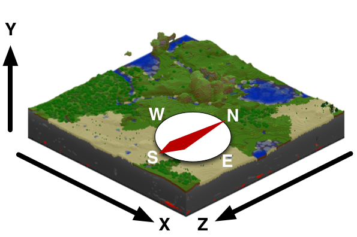

# Getting Started with Astro Pi


Astro Pi is a add on board for the Raspberry Pi Computer which adds the ability to sense all kinds of things and output information using a built in 8x8 LED matrix.
You can find out more about Astro Pi by following the [Astro Pi Guide](https://github.com/raspberrypilearning/guides/blob/master/astro-pi/README.md), this will show you how to connect and test your Astro Pi board. It also has some helpful explanations and examples of what the different inputs and outputs can do.

Once you are set up and have run your first program using the guide you can begin to experiment further using this worksheet. In order to write your programs you will need to boot your Raspberry Pi up to the desktop and start a new program in IDLE3. (Like you did in the guide)

## Displaying Text
When following the guide you will have written a sample program which scrolls text across the LED matrix, the program contains two crucial lines, which import the Astro Pi software an create an `ap` object which represents the Astro Pi board.

    ```python
    from astro_pi import AstroPi
    ap = AstroPi()
    ```

The third line is the one that starts to make the Astro Pi do something:

    ```python
        ap.show_message("Hello my name is Tim Peake")
    ```

You have probably already discovered that you you can easily change the message to your own text, however there are more things that we can do.

1. We can expand the ap.show_message command to include some extra **parameters** which will change the behaviour of the message.

    | Parameter | Effect |
    | :---: | :---: |
    | **scroll_speed** | The *scroll_speed* parameter affects how quickly the text moves on the screen the default value is 0.1. The bigger the number the **slower** the speed |
    | **text_colour** | The *text_colour* parameter alters the colour of the text and is specified as 3 values for Red,Green,Blue. Each value can be between 0 - 255, so [255,0,255] would be Red + Blue = Purple |
    | **back_colour** | The *back_colour* parameter alters the colour of the background and is specified as 3 values for Red,Green,Blue. Each value can be between 0 - 255, so [255,0,255] would be Red + Blue = Purple |

    So this program would display the text `Astro Pi is awesome!!` more slowly with the text in yellow **[255,255,0]** and the background in blue **[0,0,255]**.

    ```python
    from astro_pi import AstroPi
    ap = AstroPi()
    ap.show_message("Astro Pi is awesome!!",scroll_speed=0.05,text_colour=[255,255,0],back_colour=[0,0,255])
    ```
    You could also make the message repeat using a while loop like this:

    ```python
    from astro_pi import AstroPi
    ap = AstroPi()
    while True:
        ap.show_message("Astro Pi is awesome!!",scroll_speed=0.05,text_colour=[255,255,0],back_colour=[0,0,255])
    ```
2. The LED matrix can also display a single character rather than an entire message using the `ap.show_letter` function which also has some optional **parameters**.

    | Parameter | Effect |
    | :---: | :---: |
    | **scroll_speed** | The *scroll_speed* parameter affects how quickly the text moves on the screen the default value is 0.1. The bigger the number the **slower** the speed |
    | **text_colour** | The *text_colour* parameter alters the colour of the text and is specified as 3 values for Red,Green,Blue. Each value can be between 0 - 255, so [255,0,255] would be Red + Blue = Purple |
    | **back_colour** | The *back_colour* parameter alters the colour of the background and is specified as 3 values for Red,Green,Blue. Each value can be between 0 - 255, so [255,0,255] would be Red + Blue = Purple |

    So this program would display a single Red "J":

    ```python
    from astro_pi import AstroPi
    ap = AstroPi()
    ap.show_letter("J",text_colour=[255,0,0])
    ```

    Whilst this program would add the **sleep library** to display letters seperated by a brief pause.

    ```python
    from astro_pi import AstroPi
    import time

    ap = AstroPi()

    ap.show_letter("O",text_colour=[255,0,0])
    time.sleep(1)
    ap.show_letter("M",text_colour=[0,0,255])
    time.sleep(1)
    ap.show_letter("G",text_colour=[0,255,0])
    time.sleep(1)
    ap.show_letter("!",text_colour=[0,0,0],back_colour=[255,255,255])
    time.sleep(1)
    ap.clear()
    ```
    For added interest you could use a random number generator to choose number between 0 and 255 for the colours:

    ```python
    from astro_pi import AstroPi
    import time
    import random

    ap = AstroPi()

    r = random.randint(0,255)
    ap.show_letter("O",text_colour=[r,0,0])
    time.sleep(1)

    r = random.randint(0,255)
    ap.show_letter("M",text_colour=[0,0,r])
    time.sleep(1)

    r = random.randint(0,255)
    ap.show_letter("G",text_colour=[0,r,0])
    time.sleep(1)

    ap.show_letter("!",text_colour=[0,0,0],back_colour=[255,255,255])
    time.sleep(1)
    ap.clear()
    ```

    In both these programs the `ap.clear()` method has been used at the end to clear the matrix.


### Ideas
 - Could you use the ideas used so far to tell a joke via the LED screen?
 - All the exmaples so far could be made shorter (whilst still acheiving the same thing), can you find ways to make these shorter and more efficient.
 - How would you choose a totally random random colour, rather than just a random shade of a colour.
 - If your Astro Pi is connected to the internet you could use a twitter library to make it display incoming tweets!


## Displaying images
The LED matrix can display more that just text! we can control each LED individually to create an image. We can accomplish this in a couple of ways.

1. The first approach is to set pixels (LEDs) individually we can do this using the `ap.set_pixel()` method. but first we need to be clear about how we describe each pixel.

The Astro Pi board using a coordinate system like the one shown below, crucially the numbering begins at **0** not 1. Also the origin is in the **top left** rather than the bottom left as you may be use to.



- the blue pixel is at coordinates (0,2)
- the red pixel is at coordinates (7,4)

To replicate the above diagram you would enter a program like:

```python
from astro_pi import AstroPi

ap = AstroPi()

ap.set_pixel(0,2,[0,0,255])
ap.set_pixel(7,4,[255,0,0])
```

Can you guess what this code creates:


```python
from astro_pi import AstroPi

ap = AstroPi()

ap.set_pixel(2,2,[0,0,255])
ap.set_pixel(4,2,[0,0,255])
ap.set_pixel(3,4,[100,0,0])
ap.set_pixel(1,5,[255,0,0])
ap.set_pixel(2,6,[255,0,0])
ap.set_pixel(3,6,[255,0,0])
ap.set_pixel(4,6,[255,0,0])
ap.set_pixel(5,5,[255,0,0])
```

1. Setting pixels individually can work brilliantly, however it gets rather complex the more pixels you want to set. There is another method which can set all the pixels in one go called `ap.set_pixels`. It's use is quite straight forward, we just give a list of colour values for each pixel in the matrix.

We could enter something like:
```python
ap.set_pixels([[255,0,0],[255,0,0],[255,0,0],[255,0,0],......]) but this would take ages and be really complex.

Instead you can use some variables to define your colour palette (in this example we're using the colours of the rainbow):

```python
r = [255,0,0]
o = [255,127,0]
y = [255,255,0]
g = [0,255,0]
b = [0,0,255]
i = [75,0,130]
v = [159,0,255]
e = [0,0,0] #e stands for empty/black
```

We can then describe our matrix by creating a 2D list of colour names:

```python
image = [
e,e,e,e,e,e,e,e,
e,e,e,r,r,e,e,e,
e,r,r,o,o,r,r,e,
r,o,o,y,y,o,o,r,
o,y,y,g,g,y,y,o,
y,g,g,b,b,g,g,y,
b,b,b,i,i,b,b,b,
b,i,i,v,v,i,i,b
]

```

We can then give the `image` list to the `ap.set_pixels` methods and draw the image, the finished program would look like this:

```python
from astro_pi import AstroPi


ap = AstroPi()

r = [255,0,0]
o = [255,127,0]
y = [255,255,0]
g = [0,255,0]
b = [0,0,255]
i = [75,0,130]
v = [159,0,255]
e = [0,0,0]

image = [
e,e,e,e,e,e,e,e,
e,e,e,r,r,e,e,e,
e,r,r,o,o,r,r,e,
r,o,o,y,y,o,o,r,
o,y,y,g,g,y,y,o,
y,g,g,b,b,g,g,y,
b,b,b,i,i,b,b,b,
b,i,i,v,v,i,i,b
]

ap.set_pixels(image)
```

You should have a beautiful rainbow displayed on you LED matrix.

### Ideas
- Now you can create images on your LED matirx in 2 different ways, try creating you own images, or sprites.
- Can you alternate between images to create an animation, check out this [Geek Gurl Diaries](https://www.youtube.com/watch?v=b84EywkQ3HI) video for some inspiration.

## Setting orientation
So far all our text and images have appeared the same way up, assuming that the HDMI port is at the bottom. However this may not always be the case (especially in space) so you may want to change the orientation of the matrix. To do this you can use the `ap.set_rotation() method` and inside the brackets enter one of four angles (0, 90, 180, 270).

To rotate your screen by 180 degrees you'd use the line

```python
ap.set_rotation(180)
```

1. Which when used in the rainbow program would look like this:

    ```python
    from astro_pi import AstroPi

    ap = AstroPi()

    r = [255,0,0]
    o = [255,127,0]
    y = [255,255,0]
    g = [0,255,0]
    b = [0,0,255]
    i = [75,0,130]
    v = [159,0,255]
    e = [0,0,0]

    image = [
    e,e,e,e,e,e,e,e,
    e,e,e,r,r,e,e,e,
    e,r,r,o,o,r,r,e,
    r,o,o,y,y,o,o,r,
    o,y,y,g,g,y,y,o,
    y,g,g,b,b,g,g,y,
    b,b,b,i,i,b,b,b,
    b,i,i,v,v,i,i,b
    ]

    ap.set_pixels(image)
    ap.set_rotation(180)
    ```

2. You could also create spinning text using a for loop.

    ```python
    from astro_pi import AstroPi
    import time

    ap = AstroPi()

    ap.show_letter("J")

    for r in (0,90,180,270,0,90,180,270):
        ap.set_rotation(r)
        time.sleep(0.5)
    ```

    This prorgam display the letter "J" and then sets the rotation to each value in the brackets (0,90,180...) with a 0.5 pause.

3. You can also flip the image on the screen either horizontally or vertically using these lines:

```python
ap.flip_h()
```
or
```python
ap.flip_v()
```

With this example you could create a simple animation by flipping the image repeatedly.

    ```python
    from astro_pi import AstroPi
    import time
    ap = AstroPi()

    w = [150,150,150]
    b = [0,0,255]
    e = [0,0,0]

    image = [
    e,e,e,e,e,e,e,e,
    e,e,e,e,e,e,e,e,
    w,w,w,e,e,w,w,w,
    w,w,b,e,e,w,w,b,
    w,w,w,e,e,w,w,w,
    e,e,e,e,e,e,e,e,
    e,e,e,e,e,e,e,e,
    e,e,e,e,e,e,e,e
    ]

    ap.set_pixels(image)

    while True:
        time.sleep(1)
        ap.flip_h()
    ```

### Ideas
- Create a spinning image, use one of the drawing techniques shown already and then use the `ap.set_rotation` method to make it spin.
- Using what you've done so far you should be able to make an electronic dice like the one shown here.

    [](https://www.youtube.com/watch?edit=vd&v=4jT7GyyudP4)

    This uses:
    - Displaying text
    - Timing
    - Setting Rotation
    - Random Numbers
    - Variables

## Sensing the enviroment
The Astro PI has a set of enviromental sensors for detecting the conditions around it. It can detect:

- Pressure
- Temperature
- Humidity

We can collect these readings using three simple methods:
`ap.get_temperature()` - This will return the temperature in Celsius.
`ap.get_pressure()` - This will return the pressuin Millibars.
`ap.get_humidity()` - This returns the percentage humidity.

1. Using these we could create a simple scrolling text display, which could keep people informed about current conditions.

```python
from astro_pi import AstroPi
ap = AstroPi()

while True:
    t = ap.get_temperature()
    p = ap.get_pressure()
    h = ap.get_humidity()

    t = round(t,1)
    p = round(p,1)
    h = round(h,1)

    msg = "Temperature = %s, Pressure=%s, Humidity=%s" % (t,p,h)

    ap.show_message(msg,scroll_speed=0.05)
```

2. You could now use some colour to let the astronauts know whether conditions were within sensible ranges.

According to some [online documentation](http://wsn.spaceflight.esa.int/docs/Factsheets/30%20ECLSS%20LR.pdf) the International Space Station maintains these conditions at the following levels:
- Temperature (18.3 - 26.7 celsius)
- Pressure (979 - 1027 millibars)
- Humidity (around 60%)

You could use a if statement in your code to check these conditions and set a background colour for the scroll.
```python
if t > 18.3 and t< 26.7:
    bg = [0,100,0] #green
else:
    bg = [100,0,0] #red
```

and you cmplete program would look like this:

```python
from astro_pi import AstroPi
ap = AstroPi()

while True:
    t = ap.get_temperature()
    p = ap.get_pressure()
    h = ap.get_humidity()

    t = round(t,1)
    p = round(p,1)
    h = round(h,1)

    if t > 18.3 and t< 26.7:
        bg = [0,100,0] #green
    else:
        bg = [100,0,0] #red

    msg = "Temperature = %s, Pressure=%s, Humidity=%s" % (t,p,h)

    ap.show_message(msg,scroll_speed=0.05,backcolour=bg)
```

### Ideas
- Currently the scrolling program only warns about abnormal temperature, can you add the same behaviour for pressure and humidity?
- You could create a simple graphical thermometer which outputs different colours / patterns depending on the temperature.
- If you haven't already experiment with a bottle and the [pressure sensor](https://www.raspberrypi.org/learning/astro-pi-guide/sensors/pressure.md).

## Detecting movement
The Astro Pi board has a set of sensors that can detect movement, it has an IMU (inertial measurement unit) chip which includes:
- A gyroscope (for detecting which way up the board is)
- An accelorometer (for detecting movement)
- A magnetometer (for detecting magnetic fields)
